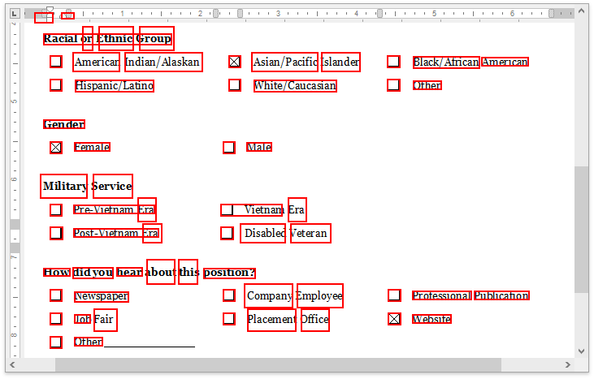
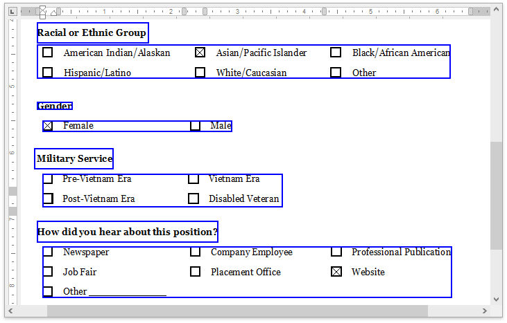

# Document Parser

A Python tool for OCR text extraction, document processing, and intelligent content classification using OpenAI.

| OCR Results (Tesseract) | OpenAI Results |
|:-----------------------:|:--------------:|
|  |  |


## Features

- Extract text from PDF and image files using OCR (Tesseract)
- Classify document elements into paragraphs and headings
- Generate visual annotations of detected text blocks

## Installation

This project uses [uv](https://github.com/astral-sh/uv) for package management:

```bash
# Clone the repository
git clone https://github.com/MostafaAbdelrashied/docs-parser
cd docs-parser

# Install with uv
uv pip install -e .

# Install development dependencies
uv pip install -e ".[dev]"
```

## Configuration

Create a `.env` file in the project root:

```
OPENAI__API_KEY=your_openai_api_key
OPENAI__MODEL=gpt-4.5-preview-2025-02-27  # Or your preferred model
```

## Usage

Process a document using the CLI:

```bash
parse --input-file path/to/your/document.pdf --output-dir data/output --lang eng
```

Or import in your Python code:

```python
from pathlib import Path
from docs_parser.processor import OCRProcessor

processor = OCRProcessor(
    input_file=Path("document.pdf"),
    output_dir=Path("output"),
    lang="eng"
)
processor.process()
```


## Requirements

- Python 3.12+
- Tesseract OCR
- Poppler (for PDF processing)

## Limitations

The current implementation has several known limitations:

1. **Complex Layouts**: Documents with non-standard layouts, multiple columns, or mixed content types may not be processed optimally.

2. **Low-Quality Images**: Documents with poor image quality, low resolution, or significant noise may result in inaccurate OCR extraction, affecting downstream processing.

3. **Context Window Limitations**: The OpenAI model has a maximum context window, limiting the size of documents that can be processed in a single pass. Very large documents may need to be processed page by page or in chunks.
